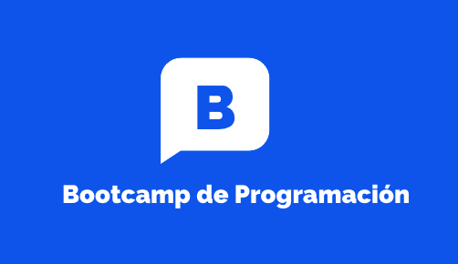

# Bootcamp de Desarrollo de Software - Nivel Principiante - Enero 2024

      
### Introducción

¡Bienvenidos al Bootcamp de Desarrollo de Software para Principiantes 2024! Este emocionante programa está diseñado para aquellos que desean adentrarse en el mundo del desarrollo de software desde cero. Prepárate para una experiencia de aprendizaje transformadora que te brindará las habilidades y conocimientos esenciales para comenzar tu carrera en el desarrollo de software.

### Detalles del Programa

- **Fechas:** Enero 2024
- **Duración:** 6 semanas
- **Modalidad:** Presencial (o en línea, según las condiciones)
- **Horario:** [Horario detallado]

### Objetivos del Programa

- Aprender los conceptos básicos de la programación y la lógica de programación.
- Familiarizarse con diferentes lenguajes de programación, incluyendo [Lista de lenguajes].
- Desarrollar habilidades para resolver problemas de manera eficiente y creativa.
- Construir proyectos prácticos y relevantes para reforzar el aprendizaje.
- Prepararse para futuras oportunidades en el campo del desarrollo de software.

### Contenido del Programa

1. Semana 1: Fundamentos de Programación
    - Introducción al desarrollo de software.
    - Conceptos básicos de programación: variables, operadores, estructuras de control.

2. Semana 2: Lenguajes de Programación
    - Exploración de lenguajes populares:  JavaScript y Java.
    - Sintaxis y estructura básica de los lenguajes.

3. Semana 3: Desarrollo Web Frontend
    - Introducción al desarrollo web.
    - Creación de interfaces interactivas con HTML, CSS y JavaScript.

4. Semana 4: Desarrollo Web Backend
    - Fundamentos de backend: servidores, bases de datos.
    - Construcción de una aplicación web completa.

5. Semana 5: Proyectos Prácticos
    - Trabajo en equipo en proyectos de desarrollo.
    - Aplicación de conocimientos en un proyecto realista.

6. Semana 6: Presentación y Futuros Pasos
    - Presentación de proyectos finales.
    - Oportunidades futuras en desarrollo de software.

### Instructores

Contaremos con un equipo de instructores con experiencia en la industria del desarrollo de software. Estarán disponibles para guiar tu aprendizaje y responder a tus preguntas.

### Requisitos

**Requisitos Mínimos:**

- **Sistema Operativo:** Windows 10, macOS, o una distribución de Linux (como Ubuntu).
- **Procesador:** Procesador de doble núcleo a 1.6 GHz o equivalente.
- **Memoria RAM:** 4 GB o más.
- **Almacenamiento:** 128 GB de almacenamiento en disco duro.
- **Conexión a Internet:** Se recomienda para acceder a recursos en línea y colaboración.
- **Resolución de Pantalla:** 1366x768 o superior.

**Recomendaciones Adicionales:**

- **Procesador:** Un procesador más rápido y con más núcleos mejorará el rendimiento al ejecutar aplicaciones más pesadas.
- **Memoria RAM:** 8 GB o más. Mayor RAM puede mejorar la capacidad para ejecutar múltiples aplicaciones y entornos de desarrollo a la vez.
- **Almacenamiento:** Un disco de estado sólido (SSD) acelerará el tiempo de inicio del sistema y la velocidad general.
- **Resolución de Pantalla:** Una pantalla de mayor resolución puede ser útil para ver más código y detalles en tu entorno de desarrollo.

**Software Necesario:**

- **Navegador Web:** Chrome, Firefox o cualquier navegador moderno para acceder a recursos en línea.
- **Editor de Código:** Recomendamos Visual Studio Code, Sublime Text, Atom o cualquier otro editor de código que prefieras.
- **Lenguajes y Herramientas:** Dependerá del currículo del bootcamp, pero es probable que necesites instalar lenguajes de programación como Python, JavaScript, y las herramientas asociadas.

Asegúrate de verificar los requisitos específicos proporcionados por la organización que ofrece el bootcamp, ya que pueden variar según el enfoque del programa y las tecnologías que se enseñen. Siempre es una buena idea tener una computadora que cumpla con los requisitos recomendados para garantizar una experiencia de aprendizaje más fluida.

***No se requiere experiencia previa en programación. Solo necesitas pasión por la tecnología y la disposición para aprender.***

### Inscripciones

Las inscripciones estarán abiertas hasta [Fecha límite]. ¡No pierdas la oportunidad de unirte a esta emocionante aventura en el mundo del desarrollo de software!

Para más información y registro, visita [Enlace de registro].

---------------------------------------------------------------------

¡Esperamos verte en enero de 2024 en el Bootcamp de Desarrollo de Software para Principiantes! Prepara tu mente para explorar, crear y construir el futuro digital.

Contacto: [Información de contacto]
Sitio web: [Sitio web del bootcamp]
